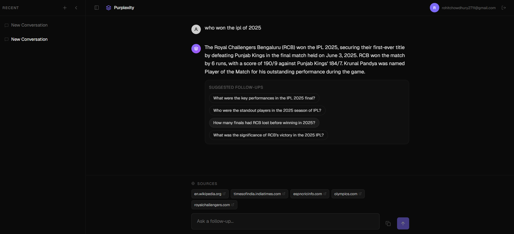

# Purplexity

> AI-powered search engine with real-time web search and conversational responses — built like Perplexity.



## Overview

Purplexity is a full-stack AI search application that lets users ask questions in natural language, searches the web in real-time using Tavily, and returns comprehensive AI-generated answers with cited sources and follow-up suggestions — streamed token-by-token.

## Tech Stack

| Layer | Technology |
|---|---|
| Frontend | React 19, Bun, Tailwind CSS, shadcn/ui, React Router |
| Backend | Express.js, Node.js, Prisma ORM |
| Database | PostgreSQL (Neon/Supabase) |
| AI | OpenAI GPT-4o-mini, Tavily Web Search |
| Auth | Supabase OAuth (Google + GitHub) |

## Features

- **Real-time Web Search** — Every query is searched via Tavily API for up-to-date information from the web
- **Streaming AI Responses** — Answers stream token-by-token using Server-Sent Events (SSE); no waiting for full response
- **Structured Answer Parsing** — AI responses are parsed to extract the main answer and suggested follow-up questions rendered as clickable chips
- **Cited Sources** — Web search results are displayed as linked source chips after each answer
- **Conversation History** — All chats are saved to PostgreSQL; sidebar shows history with instant load/delete
- **Supabase OAuth** — Secure login via Google or GitHub; JWT tokens validated server-side with session refresh
- **Optimistic UI** — Deleting a conversation removes it instantly from the list without page reload
- **Follow-up Questions** — Click any suggested follow-up chip to auto-fill the prompt and continue the conversation
- **Dark Mode** — Perplexity-inspired dark theme as default

## Project Structure

```
purplexity/
├── frontend/                  # React + Bun SPA
│   ├── src/
│   │   ├── components/         # ChatInterface, Sidebar (shadcn/ui)
│   │   ├── contexts/         # AuthContext (Supabase auth state)
│   │   ├── pages/            # Home, Auth
│   │   ├── services/         # API layer (axios + fetch for streaming)
│   │   └── types/           # TypeScript interfaces
│   └── styles/              # Tailwind globals with design tokens
├── backend/                  # Express + Prisma
│   ├── prisma/              # Schema (User, Conversation, Message)
│   ├── middleware.ts        # Supabase JWT auth middleware
│   └── index.ts             # All routes + streaming logic
└── README.md
```

## API Endpoints

| Method | Endpoint | Description |
|---|---|---|
| `POST` | `/conversations` | Create new conversation |
| `GET` | `/conversations` | List user's conversations |
| `GET` | `/conversation/:id` | Get conversation with messages |
| `DELETE` | `/conversation/:id` | Delete conversation + messages |
| `POST` | `/purplexity_ask` | Ask first question (web search + AI streaming) |
| `POST` | `/purplexity_ask/followup` | Follow-up (uses conversation history) |

## Setup

### Prerequisites

- Node.js 18+
- Bun (for frontend build)
- Supabase account (for OAuth + database)
- OpenAI API key
- Tavily API key

### Backend

```bash
cd backend
cp .env.example .env  # Fill in SUPABASE_URL, SUPABASE_KEY, OPENAI_API_KEY, TAVILY_API_KEY
bun install
bunx prisma generate
bunx prisma db push
bun run index.ts
```

Server runs on **http://localhost:3001**

### Frontend

```bash
cd frontend
cp .env.example .env  # Fill in SUPABASE_URL, SUPABASE_KEY
bun install
bun run dev
```

App runs on **http://localhost:3000**

## Architecture

```
User Login (OAuth)
      ↓
Supabase Auth Token
      ↓
Frontend → Backend (Bearer token)
      ↓
authMiddleware validates token via Supabase
      ↓
┌─────────────────────────────────┐
│  /purplexity_ask                │
│    1. Tavily web search         │
│    2. Build prompt with results  │
│    3. OpenAI streaming → SSE     │
│    4. Save user + AI message     │
│    5. Stream tokens + sources    │
└─────────────────────────────────┘
      ↓
Frontend parses tokens + <SOURCES> tag
      ↓
Render markdown + follow-up chips
```

## License

MIT
